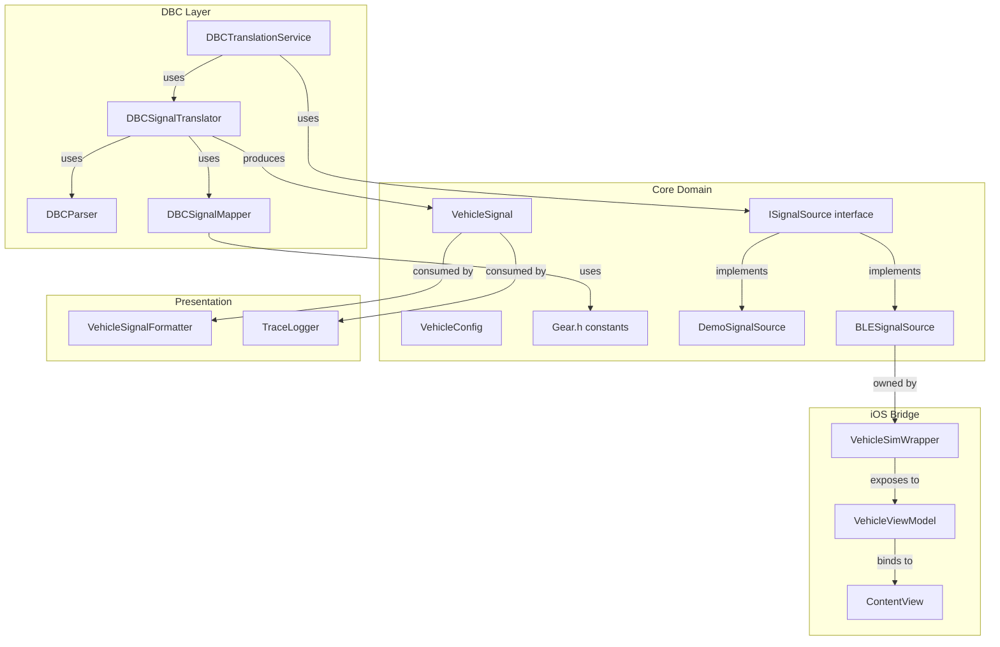

# Architecture

## Data Flow

### CLI Production Data Flow
```
CLI args → parseArgs → validateOptions → handleEarlyExit → resolveVehicleContext
  → SignalSourceFactory::create() → ISignalSource (DemoSignalSource or BLERunContext)
  → TelemetryRunner::run() → EventDispatcher → TraceLogger + stdout
```

### BLE Data Flow (when --source ble)
```
BLE → BLERunContext::run() → BLEConnectionManager → DBCTranslationService → DBCSignalTranslator
  → VehicleSignalFactory → EventDispatcher → TraceLogger + stdout
```

### iOS Data Flow
```
ISignalSource (Strategy pattern) → VehicleSimWrapper (thin bridge) → SwiftUI views
```

### Signal Source Abstraction
- `ISignalSource.h`: Abstract interface with `latestSignal()`, `start()`, `stop()`
- `DemoSignalSource`: Synthetic signal generation
- `BLESignalSource`: Live BLE data with DBC translation (used internally by BLERunContext)

### CLI Orchestration Components
- `Orchestration`: `printBanner()`, `handleEarlyExit()`, `registerSignalHandlers()`, `resolveVehicleContext()`
- `CliOptions`: `parseArgs()`, `validateOptions()`, `printHelp()`, `printSupportedSignals()`
- `SignalSourceFactory`: Factory returning ISignalSource based on `--source` flag
- `VehicleConfigResolver`: Centralizes vehicle type validation, config lookup, protocol determination, DBC loading
- `TelemetryRunner`: Unified `run()` function taking ISignalSource via DI
- `BLERunContext`: Complete BLE execution flow including health monitoring loop

### DBC Pipeline
```
git submodule (commaai/opendbc) → resources/dbc/ → DBCParser → DBCSignalDefinition → DBCSignalMapper
```

### Gear Translation
- `Gear.h`: Canonical constants (PARK=-2, REVERSE=-1, NEUTRAL=0, AUTO_1=0x1001, etc.)
- `DBCSignalMapper::mapGearSignal()`: Translates raw CAN values → Gear constants via DBC VAL_ table
- Display layer maps constants to labels via `Gear::label()`

## Component Diagram



## Removed Components (dead code)
- `CANTranslatorBase`/`.h`
- `CANSignalDecoderBase`/`.h`
- `AudiMLBTranslator`/`.h`
- `TeslaCANTranslator`/`.h`
- `AudiSignalTranslator`/`.h`
- `TeslaSignalTranslator`/`.h`
- `TeslaSignalParser`/`.h`
- `SignalTranslatorFactory`/`.h`

All translation is now DBC-driven via `DBCSignalTranslator`.